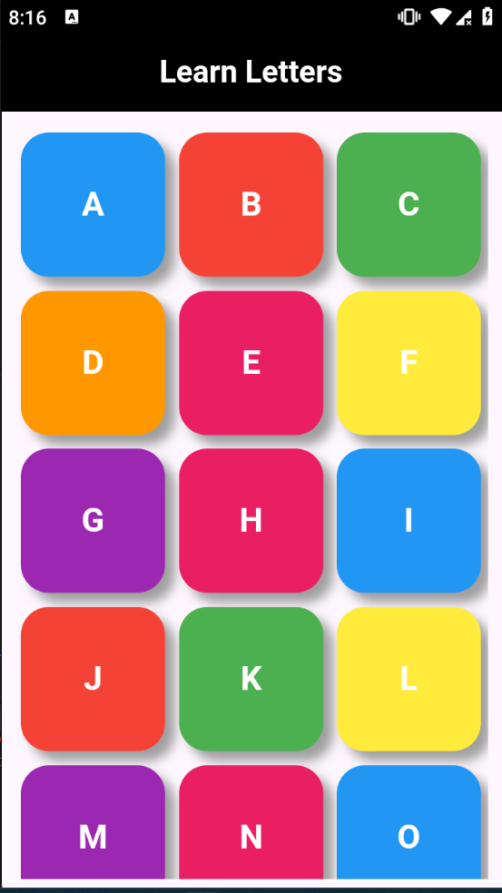
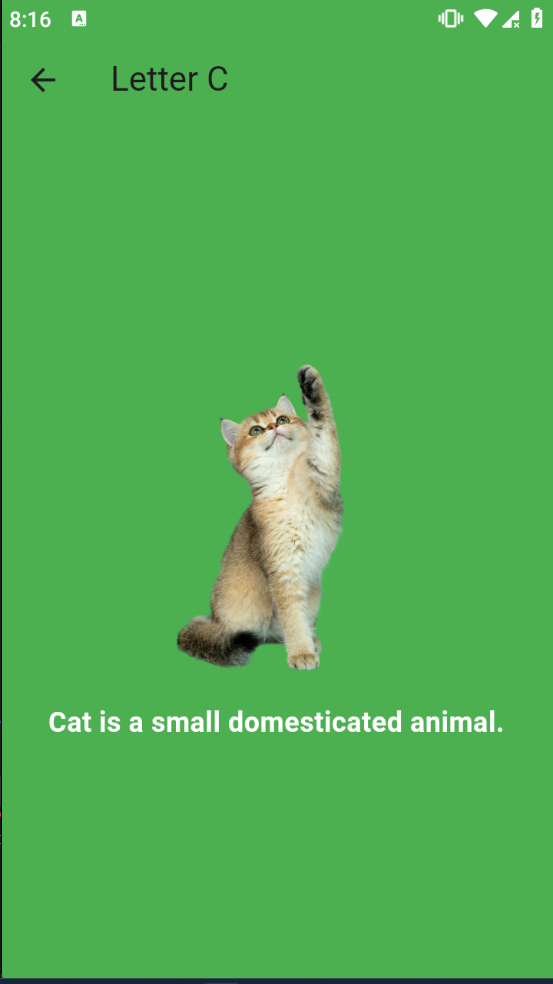
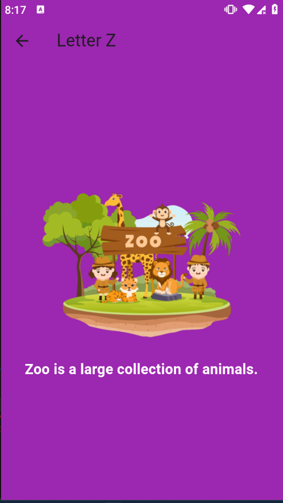
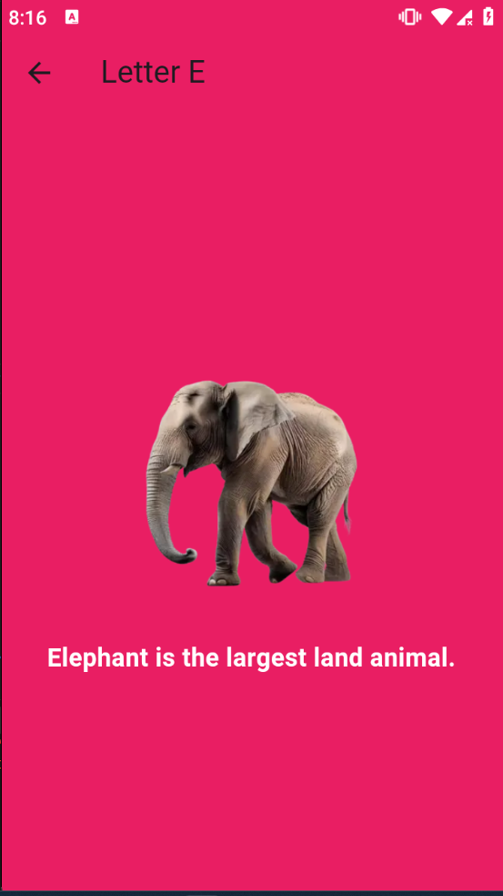

# KidsAlphaFun

**KidsAlphaFun** is a Flutter application designed to help children learn the alphabet through colorful images and engaging descriptions. Each letter is represented by a fun character or object, making learning an enjoyable and interactive experience.

---

## Features

- 🎨 **Interactive Learning**: Tap on letters to reveal related images and engaging descriptions.
- 🌈 **Colorful UI**: Vibrant, kid-friendly interface to keep children motivated and entertained.
- 📱 **Responsive Design**: The app works seamlessly across different screen sizes and devices.
- 📚 **Educational Content**: Fun facts and descriptions accompany each letter to make learning exciting and enriching.

---

## ⭐️ If you find this project useful, please give it a star! ⭐️  
Your support helps in improving and maintaining this project. Thank you!

---

## Technologies Used

- **Flutter**: A versatile UI toolkit for building cross-platform applications.
- **Dart**: A fast and efficient programming language powering Flutter.

---

## Installation

1. **Clone the Repository**:
    ```bash
    git clone https://github.com/Islam-Ragab015/KidsAlphaFun.git
    ```

2. **Navigate to the Project Directory**:
    ```bash
    cd KidsAlphaFun
    ```

3. **Install Dependencies**:
    ```bash
    flutter pub get
    ```

4. **Run the App**:
    ```bash
    flutter run
    ```

Ensure you have Flutter installed on your machine. Refer to the [official Flutter documentation](https://flutter.dev/docs/get-started/install) for installation instructions.

---

## Screenshots

Here’s a glimpse of **KidsAlphaFun** in action:

- **Home Screen**  
    

- **Letter Example: C**  
    

- **Letter Example: Z**  
    

- **Letter Example: E**  
    

---

## Usage

1. **Explore Letters**: Open the app to view a grid of alphabet letters.
2. **Interactive Experience**: Tap on any letter to see an associated image and description.
3. **Engage and Learn**: Use the colorful interface to make learning the alphabet enjoyable for kids.

---

## Contributing

We welcome contributions! If you find any bugs or have suggestions for improvement, please:

1. Fork the repository.
2. Create a branch for your feature or bug fix.
    ```bash
    git checkout -b your-branch-name
    ```
3. Commit your changes.
    ```bash
    git commit -m "Description of your changes"
    ```
4. Push your branch.
    ```bash
    git push origin your-branch-name
    ```
5. Open a pull request to the main repository.

---

## Author

Created by **Islam Elsherif**  
- [GitHub Profile](https://github.com/Islam-Ragab015)

---

## License

This project is open-source and available under the MIT License. Feel free to contribute and make learning fun for children worldwide!
